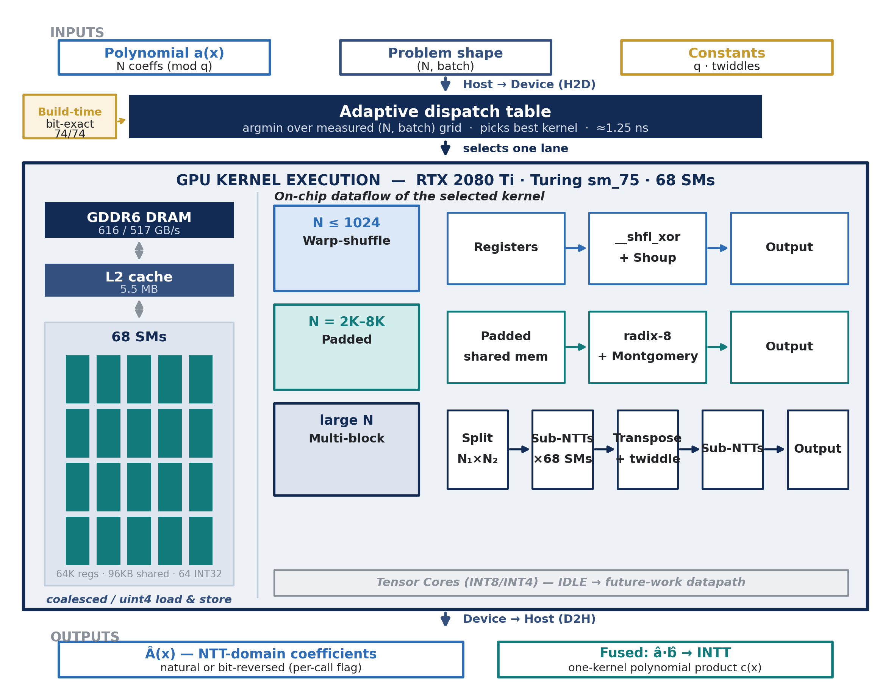

# Code guide — what every file does

A file-by-file map of this repository. For the results and the performance claims, see
[`README.md`](README.md). For a function-level breakdown, see
[`annotated/FUNCTION_REFERENCE.md`](annotated/FUNCTION_REFERENCE.md).

---

## Orientation — where to look first

| If you want to see… | Open this |
|---|---|
| The algorithm, plainly | `src/ntt_cpu.py` |
| The most interesting kernel | `codes/low_latency_cuda_ntt/warp_shuffle_ntt_kernels.cu` |
| The general-purpose kernel and our baseline | `codes/competitive_cuda_ntt/competitive_ntt_kernels.cu` |
| How a kernel is chosen at runtime | `codes/adaptive_ntt_runtime/adaptive_runtime.cu` |
| Proof that any of this is correct | `tests/test_ntt.py`, `tests/test_competitive_ntt.py` |

**Why there are five implementations of the same transform.** Each one isolates a single
question. Simple vs optimized measures the cost of recomputing twiddles; Triton vs PyTorch
measures the cost of framework dispatch; radix-4 vs radix-2 measures the cost of stage count;
CUDA vs Triton measures the cost of not controlling the kernel. Keeping all five runnable is
what turns "we made it faster" into a decomposition of *where* the time went.

---

## `codes/` — the CUDA implementation

The heart of the project. Every kernel here is hand-written; the external reference library is
linked only as a baseline to measure against.

### `codes/low_latency_cuda_ntt/`

**`warp_shuffle_ntt_kernels.cu`** — The small-N kernel (N ≤ 1024), and the signature idea of the
project. A butterfly at stage `st` pairs elements `2^st` apart, so for the first five stages that
distance is under 32 — both operands live in the same warp and are exchanged directly through the
register file with `__shfl_xor_sync`, touching no memory and requiring no barrier. Only when the
distance reaches 32 does it fall back to shared memory. Bit-reversal is folded into the load, so
the output comes out in natural order at no cost. 22 registers/thread, 0 spills, 4.5 µs latency
floor.

**`low_latency_ntt_kernels.cu`** — The same fused algorithm as the general kernel, but specialized
at **compile time** on `log2(N)`: the stage loop is fully unrolled with constant strides, and
`__launch_bounds__` pins the thread count so the compiler can allocate registers aggressively.
Written to widen the region where the small-N path stays competitive.

### `codes/competitive_cuda_ntt/`

**`competitive_ntt_kernels.cu`** — The general-purpose fused kernel and the baseline every
optimization is measured against. It works at any N and contains four design decisions that each
fixed a specific problem: 32-bit coefficient storage (halves DRAM traffic), a compile-time modulus
(no hardware division in the inner loop), all `log2(N)` stages fused into one launch (6.5× fewer
launches), and bit-reversal folded into the load. What it does *not* fix is the barrier count —
one `__syncthreads()` per stage, 13 at N = 8192 — which is what the later radix-4/8 work attacked.
Also contains `pointwise_mul`, the elementwise multiply that makes polynomial multiplication O(N)
in the transform domain.

**`bench_competitive.cu`** — Benchmark **and** correctness harness in one file, deliberately: no
timing number can be produced for a kernel that has not been validated. Builds the twiddle tables,
runs a CPU reference and an O(N²) direct DFT for comparison, then times the kernel with CUDA
events.

**`run_bench.sh`**, **`run_tests.sh`** — Cluster wrappers that set up the CUDA environment, print
the GPU identity for the record, and run the benchmark binary or the pytest suite.

### `codes/adaptive_ntt_runtime/`

**`adaptive_runtime.cu`** — The deployed system, and the file to read if you want to know how a
kernel gets chosen. It has three modes: `profile` sweeps the whole (N, batch) grid timing every
kernel on every cell; `runtime` executes realistic mixed workloads through the resulting dispatch
table; `energy` runs a workload long enough for an external power counter to sample it. The
dispatch itself is a 2-D array lookup keyed on `(log2N − 8, log2batch)` — measured at 1.25 ns,
against a transform that takes at least 4.5 µs. Every kernel passes a forward/inverse round-trip
check before it is timed or selected.

**`measure_energy.py`** — Wraps the runtime binary and reads NVIDIA's energy counter before and
after, to get energy per transform rather than just time.

**`run_runtime.sh`** — Cluster wrapper for the runtime binary.

### `codes/adaptive_ntt_bench/`

**`bench_adaptive.cu`** — Head-to-head harness: our fused kernel against the external reference
library on the same grid, with the same CUDA-event timing, alternating between them so neither
benefits from warm-up state. Finds the regime where each one wins.

**`run_bench.sh`** — Cluster wrapper.

---

## `src/` — Python implementations, benchmarks and plots

### The five NTT implementations

| File | What it is |
|---|---|
| `ntt_cpu.py` | Pure-Python reference. Slow by design — it exists to be obviously correct, and everything else is validated against it. The clearest place to read the algorithm. |
| `ntt_gpu_simple.py` | Naive PyTorch port: one GPU operation per butterfly stage, twiddles recomputed every call. Deliberately unoptimized, to serve as a baseline. |
| `ntt_gpu_optimized.py` | Same algorithm with the obvious waste removed — twiddle tables and bit-reversal permutations are computed once and cached. The difference against `simple` isolates the cost of recomputation. |
| `ntt_gpu_triton.py` | Custom GPU kernels in Triton — the first version where we control the kernel rather than the framework. One launch per stage. |
| `ntt_gpu_triton_radix4.py` | Radix-4 butterflies: two algorithm stages per launch instead of one. Measured 1.83× over radix-2, which is what later motivated radix-4/8 in the CUDA kernels. Handles odd `log2(N)` with a single radix-2 stage at the end. |
| `ntt_cuda.py` | Wraps the hand-written CUDA kernels through CuPy `RawKernel` and exposes them behind the same Python interface, so they drop straight into the existing tests and benchmarks. Includes the full `poly_mul` pipeline. |
| `ntt_cuda_montgomery.py` | A complete parallel copy of `ntt_cuda.py` using Montgomery reduction instead. It exists for a result that *didn't* pan out — swapping the arithmetic gained ~1% — which is the evidence that the bottleneck was synchronization, not arithmetic. |

All of them expose the same three methods — `forward`, `inverse`, `conv` — which is what lets one
test suite and one benchmark harness treat them interchangeably.

### Supporting code

**`utils.py`** — Shared constants (`MOD = 998244353`, `PRIMITIVE_ROOT = 3`) and the modular
arithmetic every implementation needs: exponentiation, inverse, bit-reversal indices, twiddle
tables, and an O(N²) schoolbook multiplication used as ground truth in tests.

**`ntt_selector.py`** — The Python-side dispatch table. Built **from a measured CSV**, never
hand-written: `NTTSelector.from_csv()` reads benchmark results and produces the `(N, batch) →
implementation` map.

**`ntt_cpu_bench.cpp`** — An optimized C++ CPU implementation. The "58.6× faster than CPU" claim
is measured against this, not against the slow Python reference — which is what makes the number
honest. Self-tests before it reports any timing.

### Benchmarks

Each writes a CSV that the plotting scripts consume. All follow the same discipline: warm up,
repeat, report the **median**.

| File | What it measures |
|---|---|
| `benchmark.py` | The first comparison: CPU vs simple GPU vs optimized GPU, with and without host↔device transfer |
| `benchmark_cuda.py` | The CUDA implementation across the (N, batch) grid |
| `benchmark_triton.py` | Triton radix-2 vs PyTorch-optimized vs C++ CPU |
| `benchmark_adaptive.py` | radix-4 vs radix-2 across the full grid, plus energy sampling |
| `benchmark_competitive.py` | Our fused kernel against the external reference, joined cell by cell |
| `benchmark_cpp_cpu.py` | Drives the C++ baseline binary and merges its results |
| `benchmark_polymul.py` | The full polynomial-multiplication pipeline — what applications actually call |
| `benchmark_energy.py` | Energy per multiplication, via NVIDIA's counter for the GPU and RAPL for the CPU, with idle power subtracted |
| `benchmark_oneoff_vs_repeated.py` | Answers "is precomputation worth it?" by computing the break-even number of calls |
| `build_adaptive_contribution.py` | Builds the selector table from the measured grid, runs seeded mixed workloads through it, and generates the selector-region and workload plots |

### Profiling

**`profile_cuda.py`** — Bottleneck analysis: computes memory traffic analytically (8 bytes per
coefficient, one read and one write), derives theoretical occupancy from register and shared-memory
usage against the sm_75 limits, and classifies each measurement as memory-bound or compute-bound.
This is the roofline logic.

**`profile_triton.py`** — The same treatment for the Triton path.

**`debug_cuda_conv.py`** — Diagnostic: compares every intermediate step of a CUDA convolution
against the CPU reference, to localize exactly which stage diverges when something breaks.

### Plotting

Eight scripts, all the same shape: read a committed CSV, draw figures, write to `results/plots/`.
**None of them computes a performance number** — they only draw what the benchmarks measured,
which is why every figure is reproducible from the raw data.

`plot_results.py` · `plot_cuda_results.py` · `plot_adaptive_results.py` ·
`plot_adaptive_runtime.py` · `plot_energy_results.py` · `plot_profile_results.py` ·
`plot_external_comparison.py` · `plot_direct_external_comparison.py`

---

## `tests/`

**`test_ntt.py`** — One test class per implementation, each running the same four kinds of check:

1. **Round-trip identity** — `inverse(forward(x)) == x` at every supported size. Catches scaling
   and convention errors.
2. **Agreement with the CPU reference** — the fast path must match the obviously-correct path.
3. **Cross-implementation agreement** — radix-4 must be *bit-identical* to radix-2. Two
   independently written implementations agreeing exactly is much stronger evidence than either
   one passing alone.
4. **Edge cases** — all zeros, all `q−1`, single non-zero. This is where modular-arithmetic bugs
   actually live: an overflow that never appears on random data shows up immediately at the
   maximum value.

It also asserts the kernel-launch and DRAM-pass counts quoted in the README, so a claim in the
write-up would fail the test suite if it stopped being true.

**`test_competitive_ntt.py`** — Validates the CUDA fused kernel directly, including a comparison
against the **O(N²) direct DFT** — the strongest available check, since it shares no code path
with the fast algorithm — and a full polynomial multiplication against schoolbook.

---

## `slurm/` — cluster job scripts

Every result in the report came from a batch job on a dedicated GPU node, not a shared
interactive session. That is part of why the timings are reproducible.

| Script | Runs |
|---|---|
| `run_gpu.sh` | Full test suite + the main benchmark |
| `run_cuda_benchmark.sh` | `benchmark_cuda` + `plot_cuda_results` |
| `run_triton.sh` | Test suite + the Triton benchmark |
| `run_adaptive.sh` | `benchmark_adaptive` + `plot_adaptive_results` |
| `run_polymul_benchmark.sh` | `benchmark_polymul` |
| `run_energy_benchmark.sh` | `benchmark_energy` + `plot_energy_results` |
| `run_profile_cuda.sh` | `profile_cuda` |
| `run_profile.sh` | Profiling analysis and plots (no GPU required — works from existing CSVs) |
| `run_debug.sh` | `debug_cuda_conv` |

Each one prints the node name, GPU model, driver version and compute capability before running, so
every result carries its own provenance.

---

## `annotated/` — documentation of the code

Not part of the build. Annotated copies of the key files, with the originals left untouched.

- `warp_shuffle_ntt_kernels_ANNOTATED.cu`, `competitive_ntt_kernels_ANNOTATED.cu` — line-by-line
  English commentary
- `*_HEBREW.cu`, `ntt_cpu_HEBREW.py` — the same in Hebrew, cross-referenced to the project
  presentation
- `FUNCTION_REFERENCE.md` / `.pdf` — every function in the repository, explained
- `מדריך_קוד_לפי_שקפים.md` — which file to open for which slide of the talk

---

## How the pieces connect

```
   ntt_cpu.py  ──────────────►  the reference everything is checked against
        │
        ├── tests/ ────────────►  correctness gate  (must pass before any timing)
        │
   benchmarks ────────────────►  results/raw/*.csv
        │                              │
        │                              ├──►  plot_*.py  ────►  results/plots/*.png
        │                              │
        │                              └──►  ntt_selector.py / adaptive_runtime.cu
        │                                        │
        └────────────────────────────────────────┴──►  the dispatch table
                                                        (measured, not hand-written)
```

The single rule that holds the whole thing together: **no kernel is timed before it passes the
correctness gate, and no claim is made that isn't backed by a committed CSV.**

---

## Reproducing the results

```bash
# environment
python -m venv .venv && source .venv/bin/activate
pip install torch cupy triton numpy pytest pynvml

# correctness first — nothing else is meaningful without it
python -m pytest tests/ -v

# benchmarks (on the cluster)
sbatch slurm/run_gpu.sh
sbatch slurm/run_cuda_benchmark.sh
sbatch slurm/run_adaptive.sh

# figures, from the committed CSVs — no GPU needed
python -m src.plot_results
python -m src.plot_cuda_results
```

**Hardware used:** NVIDIA RTX 2080 Ti (Turing TU102, sm_75), driver 550.120, CUDA 12.4.
**Build flags:** `nvcc -O3 -std=c++17 -gencode arch=compute_75,code=sm_75`.
**Timing:** CUDA events, warm-up excluded, median of repeated runs.


# GPU-Accelerated Number Theoretic Transform (NTT)

Architecture-aware CUDA kernels for the Number Theoretic Transform on an NVIDIA RTX 2080 Ti
(Turing, sm_75), with a compiled adaptive runtime that dispatches the measured-best kernel
per problem size.

**Final project 3363 — Tel Aviv University, Iby and Aladar Fleischman Faculty of Engineering**
Kareem Bwakny · Hakeem Najjar · Advisor: Mr. Oren Ganon

---

## Results

Modulus `q = 998244353`, primitive root `g = 3`, sizes `N = 256–16384`, batches `1–8192`.
All numbers below are from the authoritative `job-180` run (CUDA events, WARM=5 / REP=101),
correctness-gated bit-exactly before timing.

| Metric | Value |
|---|---|
| Peak throughput | **110.9 M transforms/s** (N=256, batch 8192) |
| Small-N latency floor | **4.5 µs** |
| Cumulative kernel tuning | **1.94×** end to end |
| Saturated-regime bandwidth | **86%** of the measured 517 GB/s DRAM roofline (was 53%) |
| vs optimized C++ CPU | up to **58.6×** |
| vs external GPU NTT reference | **70 / 74** cells faster, up to **2.12×** |
| Correctness | **74 / 74** configurations bit-exact |

The measured DRAM roofline (517 GB/s, STREAM-style probe) is used throughout instead of the
616 GB/s datasheet peak; both are reported where relevant.

## The central finding

The NTT is not bound by one bottleneck but by a **chain** of them — removing one exposes
the next:

1. **Barrier count** — radix-4/8 butterflies perform 2–3 stages per barrier, cutting
   `__syncthreads()` from 13 to 5 at N=8192.
2. **Barrier cost** — block-size tuning puts several blocks on each SM, so a barrier stalls
   part of an SM instead of all of it (1.58× at N=2048).
3. **Twiddle-table footprint** — with synchronization largely removed, Montgomery's single
   32-bit constant per twiddle beats Shoup's pair above N=4096 *despite more ALU work*,
   because the table is half the size.

Lazy reduction was tested and **rejected** (0.994×), confirming the conditional subtractions
were never the constraint.

## Kernel families

| Kernel | Regime | Key idea |
|---|---|---|
| Warp-shuffle + Shoup | N ≤ 1024 | Early stages register-resident via `__shfl_xor_sync`; no shared memory, no barriers |
| Padded shared memory + radix-8 | N = 2048–8192 | Bank-conflict-free `SPAD(i)=i+⌊i/32⌋`; 3 stages per barrier |
| Multi-block 4-step (radix-4) | large N, low batch | `N = N₁·N₂` spread across all 68 SMs; 1.65× over prior design |
| Fused polynomial multiply | NTT · pointwise · INTT | One launch replaces four; DRAM traffic 9N → 3N words |
| Adaptive selector | all | Compiled dispatch table, ~1.25 ns lookup |

## Architecture



End-to-end pipeline with the GPU stage opened to its memory hierarchy and the per-regime
on-chip dataflow. See `figures/gpu_interior.png` for the SM-level resource mapping.

## Repository layout

```
docs/                   Methodology, kernel audit, hardware profile, selector design,
                        and RESULTS_job180.md (the consolidated final number set)
results/raw/            Benchmark CSVs (baseline generation — see note below)
results/plots/          Plots generated from the raw CSVs
figures/                Figures used in the report and poster
figures/src/            Matplotlib scripts that regenerate them
deliverables/           Project report (EN/HE), poster, presentation
```

> **Note on scope.** This repository currently contains the documentation, measurement data,
> figures, and written deliverables. The CUDA kernel sources live in the cluster working tree
> and are pending a push from that machine; `results/raw/` here is the baseline-generation
> data, while the final `job-180` numbers are documented in `docs/RESULTS_job180.md`.

## Methodology

- Hardware: RTX 2080 Ti (Turing TU102, sm_75), driver 550.120, CUDA 12.4
- Build: `nvcc -O3 -std=c++17 -gencode arch=compute_75,code=sm_75`
- Timing: CUDA events, WARM=5 / REP=101, steady clocks after warm-up
- Correctness gate: edge inputs (zeros, one-hot, all-`q−1`), random inputs, and inverse
  round-trip — **no timing is reported for a kernel that has not passed it**
- Accept/reject comparisons are run **round-robin** (interleaved with their baseline). At
  N ≤ 512, cross-run absolute deltas are not treated as admissible evidence; three
  fixed-order timing artifacts were identified and eliminated during the work.

## Known limitations

- Hardware performance counters are restricted to administrators on the benchmark cluster,
  so achieved occupancy and stall reasons are attributed by controlled experiment rather
  than measured with Nsight Compute.
- The INT8/INT4 tensor cores are idle by design. A digit-decomposed tensor-core path was
  investigated and rejected on measured grounds: the 45× compute advantage does not
  overcome an O(N²) matmul formulation when the kernels are memory-bound.

## License

Academic project — see the report for citations to prior work.
